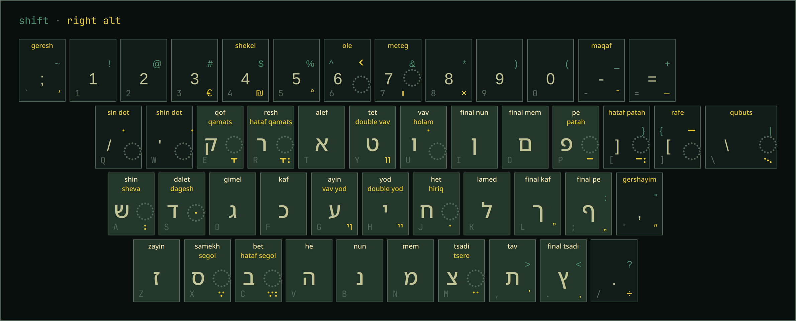
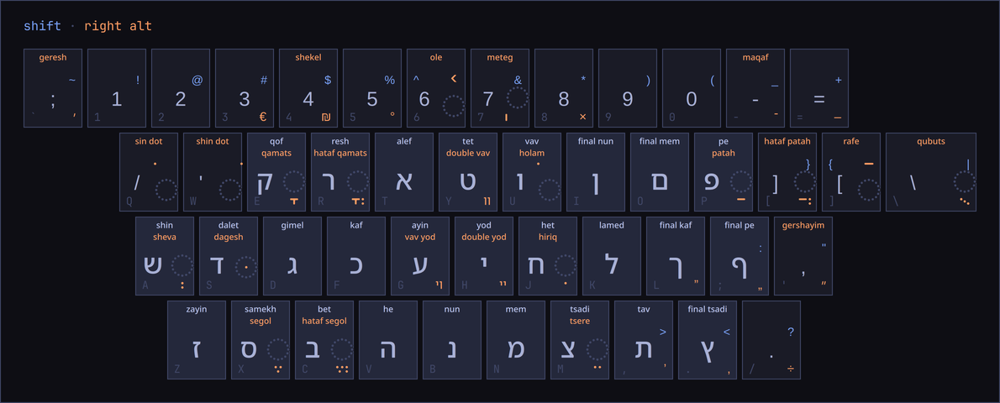
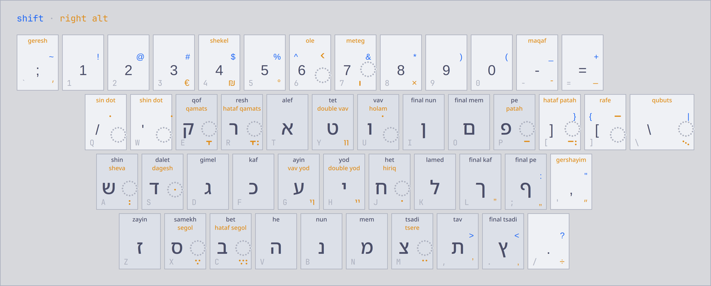
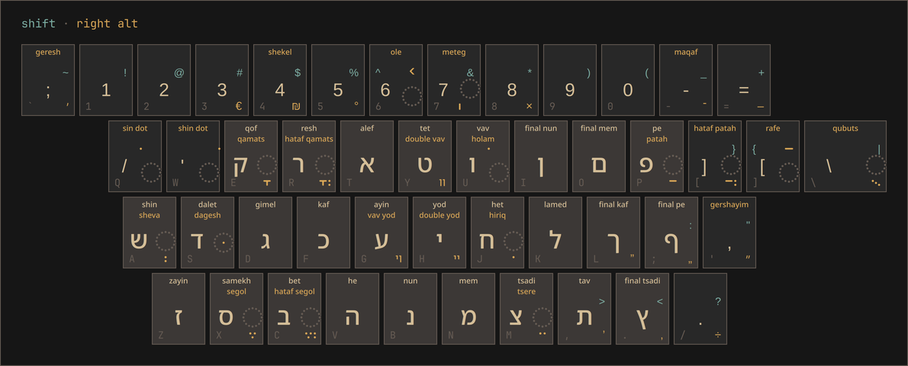
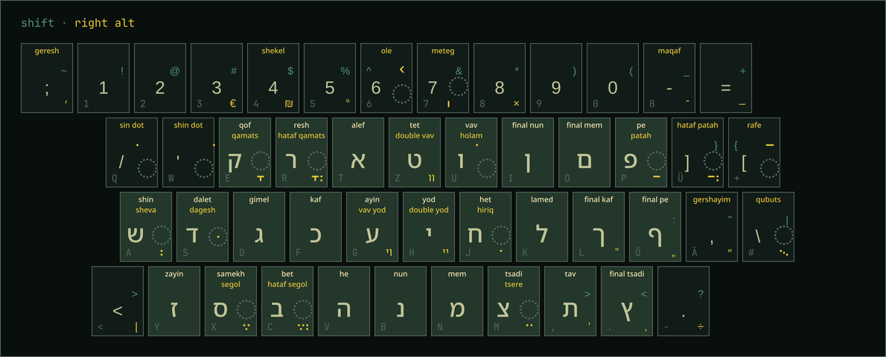

# Hebrew Keyboard Overlay for Omarchy

This is for people who type Hebrew on a keyboard without Hebrew letters printed on
it.

It is an [Omarchy](https://omarchy.org) shell plugin that shows the Hebrew
keyboard layout as an overlay on the screen. The overlay doesn't take keyboard
focus, so you can keep typing while it is open.



Each key shows:

- the Hebrew character, with its name (shin, final kaf, …), including niqqud
- the Shift character
- the label on the physical key it sits on (see `labels` below)

The keyboard is drawn from your Hyprland keyboard configuration, including
layout variants such as `il(phonetic)`, and uses the colors of the current
Omarchy theme. It can be moved and resized with the mouse and reopens at the
same place and size.

| Tokyo Night | Catppuccin Latte | Gruvbox |
| --- | --- | --- |
|  |  |  |

## Requirements

- Omarchy 4.x (with `omarchy-shell` and the `omarchy plugin` commands)
- Hebrew (`il`) among your Hyprland keyboard layouts (see below)
- `libxkbcommon` (`xkbcli`), `noto-fonts` (Noto Sans Hebrew) and `libnotify`
  (`notify-send`, for error notifications). Install any that are missing with
  `omarchy pkg add <name>`.

## Install

```bash
omarchy plugin add https://github.com/mtesseract/omarchy-hebrew-keyboard-overlay.git --enable
```

Bind a key in `~/.config/hypr/bindings.lua`:

```lua
o.bind("SUPER + SHIFT + H", "Hebrew keyboard", "omarchy-shell shell toggle silverratio.hebrew-keyboard-overlay")
```

or, with `bindings.conf`:

```
bindd = SUPER SHIFT, H, Hebrew keyboard, exec, omarchy-shell shell toggle silverratio.hebrew-keyboard-overlay
```

Then restart the shell:

```bash
omarchy restart shell
```

The plugin id is `silverratio.hebrew-keyboard-overlay`.

## Keyboard setup

The plugin does not change your keyboard configuration. To type Hebrew, add
the `il` layout and a key for the third level in `~/.config/hypr/input.lua`:

```lua
hl.config({
  input = {
    kb_layout = "us,il",
    kb_options = "lv3:ralt_switch",
  },
})
```

- Keep `us` first; Hyprland resolves keybindings against the first layout.
- `lv3:ralt_switch` makes Right Alt select the third level, where the niqqud
  are. The header of the overlay names the key set by your `lv3:` option.
- If you already set `kb_layout` or `kb_options`, add to them; a later
  `hl.config` call replaces the whole value.

Switching between layouts is up to you, for example with a `grp:*` option such
as `grp:alts_toggle` or a keybinding that runs
`hyprctl switchxkblayout all next`.

## Settings

Settings go on the plugin's entry in the `plugins` list of
`~/.config/omarchy/shell.json`, which `omarchy plugin add --enable` creates:

```json
{ "id": "silverratio.hebrew-keyboard-overlay", "keyboard": "iso" }
```

| Setting | Values | Default |
| --- | --- | --- |
| `keyboard` | `ansi` or `iso` (a file name in `keyboards/`): the shape of your physical keyboard. ISO keyboards (common in Europe) have an extra key left of Z and the backslash key next to Enter. | `ansi` |
| `labels` | The layout printed on your keycaps, for the small labels in the bottom-left corner of each key, e.g. `us` if you type Dvorak on QWERTY keycaps. | your first non-Hebrew layout in `kb_layout`, with its variant |

An ISO keyboard with German keycaps (`de,il` in `kb_layout` and
`"keyboard": "iso"`):



Changes apply when the shell reloads `shell.json`; if they don't show, run
`omarchy restart shell`.

## Usage

- Your keybinding shows and hides the overlay.
- Drag it with the left mouse button to move it.
- Drag its top-right corner to resize it.
- Position and size are saved in
  `~/.local/state/omarchy/hebrew-keyboard-overlay.json`; delete that file to
  return to the default size and the default position above the bottom edge.

## Update / uninstall

```bash
omarchy plugin update silverratio.hebrew-keyboard-overlay
omarchy restart shell
```

To uninstall, run `omarchy plugin remove silverratio.hebrew-keyboard-overlay`,
remove the keybinding, and run `omarchy restart shell`.

## How it works

- `HebrewKeyboard.qml` reads the active keyboard from `hyprctl devices`, runs
  `xkbcli compile-keymap` for its `il` entry, and reads the theme colors from
  `~/.local/state/omarchy/current/theme/colors.toml`. It shows the keyboard on
  a layer-shell surface on the focused monitor. The surface has no keyboard
  focus and only takes mouse input over the keyboard. Layout and theme are read
  again on every open.
- `Keyboard.qml` draws the overlay. It loads the physical keyboard from
  `keyboards/<keyboard>.qml`, which lists its rows of keys; to support another
  keyboard type, add a file there. `KeyRows.qml` lays the rows out and
  `Key.qml` draws a single key.
- `Command.qml` runs `hyprctl` and `xkbcli` and reports when one of them
  can't be started.
- `Keymap.js` parses the `xkbcli` output into the characters for each key and
  holds the character names.
- `preview.qml` runs the overlay outside omarchy-shell for development:
  `qs -p preview.qml`, stopped with `qs kill -p preview.qml`.

## License

MIT
